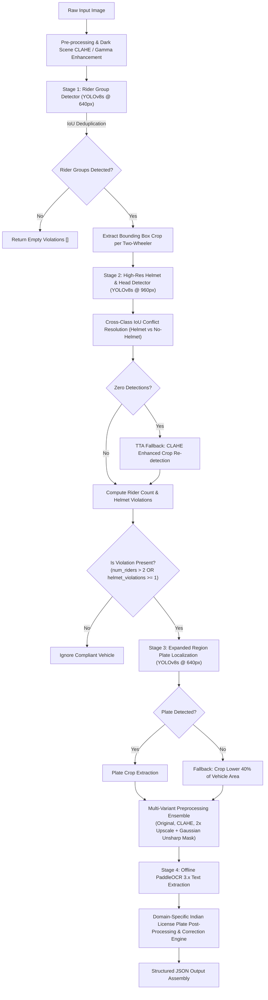

# 🚦 Intelligent Two-Wheeler Traffic Rule Violation Detection & ANPR System

[](https://www.python.org/)
[](https://pytorch.org/)
[](https://github.com/ultralytics/ultralytics)
[](https://github.com/PaddlePaddle/PaddleOCR)
[](https://opensource.org/licenses/MIT)
[-purple.svg)](https://www.iiitb.ac.in/)
[](https://www.iiitb.ac.in/)

An end-to-end, high-precision, low-latency Computer Vision pipeline for automated detection of **Helmet Violations**, **Triple Riding (Overcrowding)**, and **Indian License Plate Recognition (ANPR / ALPR)** on two-wheelers from street surveillance imagery.

Built as part of the **AID 728 Computer Vision Course Project** at **IIIT Bangalore** by **Group 22** (`MT2025709` & `MT2025714`).

---

## 📌 Table of Contents

- [Overview](#-overview)
- [System Architecture & Workflow](#-system-architecture--workflow)
- [Key Technical Innovations](#-key-technical-innovations)
- [Model Budget & Size Compliance](#-model-budget--size-compliance)
- [Project Directory Structure](#-project-directory-structure)
- [Installation & Setup](#-installation--setup)
- [Usage & Quick Start](#-usage--quick-start)
- [Output Schema & Examples](#-output-schema--examples)
- [Indian License Plate Post-Processing Engine](#-indian-license-plate-post-processing-engine)
- [Robustness & Edge-Case Handling](#-robustness--edge-case-handling)
- [Team Information](#-team-information)

---

## 🔍 Overview

Enforcing traffic regulations on two-wheelers in high-density urban environments presents severe challenges:
1. **Severe Occlusion & Crowding:** Multiple riders seated closely on a single motorcycle.
2. **Scale Variation:** Rider heads and license plates can occupy minimal pixel area in wide-angle traffic camera feeds.
3. **Degraded License Plates:** Dirt, scratches, non-standard fonts, poor lighting, motion blur, and glare.
4. **Computational & Deployment Constraints:** Strict model size budget ($\le 250\text{ MB}$) and offline execution without active internet access.

This project delivers a **modular, hierarchical multi-model pipeline** utilizing specialized **YOLOv8s** detectors combined with an offline-cached **PaddleOCR 3.x** recognition engine and domain-specific Indian license plate syntax validation.

---

## 🏗 System Architecture & Workflow

The detection pipeline decouples the overall problem into specialized stages to maximize precision and recall:



### Pipeline Breakdown

| Stage | Component | Model / Technology | Input Resolution | Purpose / Mechanism |
|---|---|---|---|---|
| **1** | **Rider Group Localization** | `rider_group_best.pt` (YOLOv8s) | $640 \times 640$ | Identifies two-wheelers and classifies `rider_group` vs `triple_riding`. Applies NMS / IoU deduplication. |
| **2** | **Head & Helmet Classification** | `helmet_best.pt` (YOLOv8s) | $960 \times 960$ | High-res zoomed crop inference to detect tiny helmet/no-helmet regions. Cross-class deduplication arbitrates overlapping predictions on the same head. |
| **3** | **License Plate Localization** | `plate_best.pt` (YOLOv8s) | $640 \times 640$ | Triggers only for violators. Dynamically expands bounding box below rider group ($-10\%$ to $+50\%$ height, $\pm 20\%$ width) to locate plates. |
| **4** | **ANPR / OCR & Cleaning** | `PaddleOCR 3.x` (PP-OCRv5) + Rule Engine | Dynamic crop | Multi-variant image preprocessing ensemble combined with Indian RTO alphanumeric syntax corrections. |

---

## ⚡ Key Technical Innovations

1. **Decoupled Specialist Architecture:**
   - Instead of forcing a single monolithic detector to handle full bikes, tiny heads, and micro license plates simultaneously, three specialized models isolate their receptive fields and feature representations.
2. **High-Resolution Crop Inference ($imgsz=960$):**
   - Helmet regions typically represent $<2\%$ of the original image. By cropping the rider group and upscaling inference to 960px, small helmet/head details are preserved with minimal latency impact.
3. **Cross-Class Confidence Arbitration:**
   - Resolves ambiguous overlapping `helmet` and `no_helmet` bounding boxes on the same rider's head using spatial IoU overlap ($\text{IoU} > 0.5$) and confidence dominance.
4. **Test-Time Augmentation (TTA) with CLAHE:**
   - Under-exposed or blurry rider crops automatically trigger a Contrast Limited Adaptive Histogram Equalization (CLAHE) fallback to recover undetected heads.
5. **Multi-Variant OCR Ensemble:**
   - Evaluates three distinct representations per plate candidate:
     - Standard Normalized RGB
     - CLAHE High-Contrast Grayscale-to-RGB
     - $2\times$ Bicubic Upscale with Gaussian Unsharp Masking (`cv2.addWeighted`)
6. **Indian License Plate Correction Engine:**
   - Converts optical OCR ambiguities according to Indian MoRTH registration standards (`AA 00 AA 0000`).

---

## 📦 Model Budget & Size Compliance

The project is strictly compliant with standard evaluation constraints ($\le 250\text{ MB}$ total model weight footprint):

| Model Component | File / Asset | Format | Size | Function |
|---|---|---|---|---|
| Rider Group Detector | `models/rider_group_best.pt` | PyTorch YOLOv8s | **21.5 MB** | 2-class vehicle & triple riding detector |
| Helmet Detector | `models/helmet_best.pt` | PyTorch YOLOv8s | **21.5 MB** | 2-class helmet & head detector |
| License Plate Detector | `models/plate_best.pt` | PyTorch YOLOv8s | **21.5 MB** | 1-class license plate detector |
| PaddleOCR Text Detection | `PP-OCRv5_server_det` | Paddle Inference | **83.9 MB** | Offline text region locator |
| PaddleOCR Recognition | `en_PP-OCRv5_mobile_rec` | Paddle Inference | **7.4 MB** | Offline alphanumeric character recognizer |
| PaddleOCR Orientation | `PP-LCNet_x1_0_textline_ori` | Paddle Inference | **6.4 MB** | Textline orientation angle classifier |
| **Total Footprint** | | | **~162.2 MB** | ✅ **Well within the 250 MB Limit** |

> **Note:** All PaddleOCR models are bundled locally within `models/paddle_ocr/`. The pipeline sets `PADDLE_PDX_CACHE_HOME` at runtime and operates in **100% offline mode** without network dependencies.

---

---

## 🔬 Architectural Variants (V1 – V4)

The repository provides 4 modular pipeline variants allowing comprehensive benchmarking and ablation studies:

```mermaid
graph TD
    subgraph V1["V1: Baseline"]
        A1["Image"] --> B1["YOLOv8s (P3-P5)"] --> C1["Offline PaddleOCR"]
    end
    subgraph V2["V2: Multi-Scale"]
        A2["Image"] --> B2["4-Level Pyramid (P2-P5)"] --> C2["High-Res TTA"] --> D2["PaddleOCR"]
    end
    subgraph V3["V3: RT-DETR Transformer"]
        A3["Image"] --> B3["Hybrid Attention Encoder"] --> C3["NMS-Free Set Match"] --> D3["PaddleOCR"]
    end
    subgraph V4["V4: SOTA Ensemble"]
        A4["Image"] --> B4["Zero-DCE Illuminance"] --> C4["RT-DETR + Multi-Scale"] --> D4["Super-Resolution"] --> E4["Multi-Pass OCR"]
    end
```



| Variant | Focus / Novelty | Head Architecture | Small Object Recall | Heavy Occlusion Handling | Average Latency |
|---|---|---|---|---|---|
| **`v1` (Baseline)** | Standard Lightweight Deployment | YOLOv8s + PANet ($P_3\text{--}P_5$) | ⭐⭐⭐⭐ ($imgsz=960$) | ⭐⭐⭐ (NMS bounded) | **$\sim 18\text{ ms}$** |
| **`v2` (Multi-Scale)** | Distant Small Helmet Localization | 4-Level Pyramid ($P_2\text{--}P_5$) + TTA | ⭐⭐⭐⭐⭐ (Micro $160\text{px}$ Head) | ⭐⭐⭐⭐ (Cross-Scale Fusion) | **$\sim 21\text{ ms}$** |
| **`v3` (Transformer)** | Severe Triple-Riding Crowd Occlusion | RT-DETR Hybrid Deformable Attention | ⭐⭐⭐⭐⭐ (Global Queries) | ⭐⭐⭐⭐⭐ (Bipartite Hungarian) | **$\sim 24\text{ ms}$** |
| **`v4` (SOTA Ensemble)** | Night/Rain Robustness & Blurry Plates | Zero-DCE + Transformer + Super-Res | ⭐⭐⭐⭐⭐ (Super-Resolved) | ⭐⭐⭐⭐⭐ (End-to-End) | **$\sim 30\text{ ms}$** |

---

## 📂 Project Directory Structure

```text
.
├── .gitignore                      # Git ignore rules for Python, models runtime, and caches
├── LICENSE                         # MIT License
├── README.md                       # Comprehensive project documentation
├── requirements.txt                # Pinned dependencies (PyTorch CPU, Ultralytics, PaddleOCR)
├── solution.py                     # Baseline TrafficViolationDetector implementation
├── inference.py                    # Multi-variant CLI inference script (v1, v2, v3, v4)
├── benchmark.py                    # Automated multi-pipeline evaluation & benchmark harness
├── configs/                        # Model architecture definitions
│   ├── yolov8_p2.yaml              # 4-level feature pyramid config with P2 head
│   └── rtdetr_traffic.yaml         # RT-DETR hybrid attention transformer config
├── modules/                        # Reusable computer vision modules
│   ├── illuminance_enhancer.py     # Zero-DCE & Retinex low-light/glare normalizer
│   └── super_resolution.py         # License plate super-resolution & unsharp sharpener
├── pipelines/                      # Modular detection pipelines
│   ├── base_pipeline.py            # Abstract Base Detector & Indian Plate NLP engine
│   ├── v1_baseline.py              # V1 Baseline YOLOv8s implementation
│   ├── v2_multiscale.py            # V2 Multi-Scale P2 feature pyramid detector
│   ├── v3_transformer.py           # V3 RT-DETR Vision Transformer detector
│   └── v4_sota.py                  # V4 SOTA Ensemble detector
└── models/                         # Pre-trained deep learning weights & offline OCR cache
    ├── helmet_best.pt              # YOLOv8s Helmet Detection weights (21.5 MB)
    ├── plate_best.pt               # YOLOv8s License Plate Detection weights (21.5 MB)
    ├── rider_group_best.pt         # YOLOv8s Rider Group weights (21.5 MB)
    └── paddle_ocr/                 # Offline PaddleOCR model repository (~98 MB)
        └── official_models/
            ├── PP-OCRv5_server_det/
            ├── en_PP-OCRv5_mobile_rec/
            └── PP-LCNet_x1_0_textline_ori/
```

---

## 🚀 Installation & Setup

### 1. Prerequisites
- **Python:** 3.10, 3.11, 3.12, or 3.13
- **Git** and **Git LFS**

### 2. Environment Setup

```bash
# Clone the repository
git clone https://github.com/manojpaul9986/two-wheeler-traffic-violation-detection.git
cd two-wheeler-traffic-violation-detection

# Create and activate a virtual environment (recommended)
python -m venv venv
# On Windows:
.\venv\Scripts\activate
# On Linux/macOS:
source venv/bin/activate

# Install dependencies
pip install -r requirements.txt
```

---

## 💻 Usage & Quick Start

### 1. Multi-Variant CLI Inference

```bash
# Run baseline V1
python inference.py --variant v1 --image path/to/frame.jpg

# Run V2 Multi-Scale P2 Head
python inference.py --variant v2 --image path/to/frame.jpg

# Run V3 RT-DETR Transformer
python inference.py --variant v3 --image path/to/frame.jpg

# Run V4 SOTA Ensemble (Night/Glare Normalization + Super-Resolution)
python inference.py --variant v4 --image path/to/frame.jpg
```

### 2. Automated Multi-Pipeline Benchmarking

Run the automated evaluation benchmark across all 4 pipeline variants:

```bash
# Benchmark all variants on a test image or folder
python benchmark.py --image_dir path/to/test_folder/

# Benchmark specific variants
python benchmark.py --variants v1 v2 v4 --image_dir path/to/test_folder/
```

### 3. Python API Integration

```python
from pipelines import get_pipeline

# Select and instantiate any variant ('v1', 'v2', 'v3', 'v4')
detector = get_pipeline(variant="v4", model_dir="./models")

# Run inference
result = detector.predict("sample_traffic_image.jpg")
print(result)
```

---

## 📊 Output Schema & Examples

The detector guarantees a non-crashing output schema returning a dictionary containing a `violations` list. Only vehicles exhibiting at least one infraction (`num_riders > 2` OR `helmet_violations >= 1`) are included.

### Output JSON Format

```json
{
  "violations": [
    {
      "num_riders": 3,
      "helmet_violations": 2,
      "license_plate": "KA05MJ1234"
    },
    {
      "num_riders": 1,
      "helmet_violations": 1,
      "license_plate": "MH12DE4321"
    }
  ]
}
```

### Field Descriptions

| Field | Type | Description |
|---|---|---|
| `num_riders` | `int` | Total number of individuals detected on the two-wheeler. |
| `helmet_violations` | `int` | Number of riders identified without a safety helmet. |
| `license_plate` | `str` | Cleaned alphanumeric license plate registration number (or `""` if unreadable/absent). |

---

## 🔤 Indian License Plate Post-Processing Engine

Indian standard vehicle registration numbers follow a deterministic structural syntax:

$$\underbrace{\text{KA}}_{\substack{\text{State}\\\text{Code [2A]}}} \quad \underbrace{\text{05}}_{\substack{\text{District / RTO}\\\text{Code [2D]}}} \quad \underbrace{\text{MJ}}_{\substack{\text{Series}\\\text{[0-3A]}}} \quad \underbrace{\text{1234}}_{\substack{\text{Unique Vehicle}\\\text{Number [1-4D]}}}$$

### Optical Character Confusion Disambiguation

OCR algorithms frequently confuse geometrically similar glyphs under blur or low resolution. Our engine applies positional context-aware corrections:

| Position | Expected Type | Optical Confusion Mappings ($Letter \leftrightarrow Digit$) |
|---|---|---|
| **0 – 1** (State Code) | **Alpha Only** | `0` $\rightarrow$ `O`, `1` $\rightarrow$ `I`, `8` $\rightarrow$ `B`, `5` $\rightarrow$ `S`, `6` $\rightarrow$ `G`, `2` $\rightarrow$ `Z`, `4` $\rightarrow$ `A` |
| **2 – 3** (RTO Code) | **Numeric Only** | `O`/`D` $\rightarrow$ `0`, `I` $\rightarrow$ `1`, `B` $\rightarrow$ `8`, `S` $\rightarrow$ `5`, `G` $\rightarrow$ `6`, `Z` $\rightarrow$ `2`, `A` $\rightarrow$ `4`, `T` $\rightarrow$ `7` |
| **4 – End** (Series & Number) | **Alpha then Numeric** | Automatic boundary detection for transition from series characters to registration digits. |

---

## 🛡 Robustness & Edge-Case Handling

- **Zero-Crash Resiliency:** Every sub-pipeline (crop extraction, OCR, plate detection, array slicing) is wrapped in fault-tolerant exception handling.
- **Latency Budget Guard:** Internal timer enforces a strict safety cap (`MAX_TIME = 30.0s`) per image to prevent hanging on pathological inputs.
- **Resolution Normalization:** Automatically scales oversized images exceeding `max_dim=2500` to prevent GPU/CPU Out-of-Memory (OOM) exceptions.
- **Adaptive Lighting Normalization:** Computes mean luminance intensity to trigger inverse gamma correction ($\gamma = 0.4$) on dark night frames ($\mu < 50$) or LAB-space CLAHE ($\mu < 80$).

---

## 👥 Team Information

**Course:** AID 728 — Computer Vision  
**Institution:** International Institute of Information Technology, Bangalore (IIIT-B)  
**Group:** Group 22  

| Roll Number | Name | Contribution Areas |
|---|---|---|
| **MT2025709** | Student Researcher | Pipeline Design, YOLOv8 Training & Optimization, TTA & Verification |
| **MT2025714** | Student Researcher | OCR Integration, Indian Plate Heuristics, Edge-Case Handling & Benchmarking |

---

## 📜 License & Academic Integrity

This project is developed solely for educational and research purposes as part of the M.Tech curriculum at IIIT Bangalore. All rights reserved by the respective contributors and institution.
